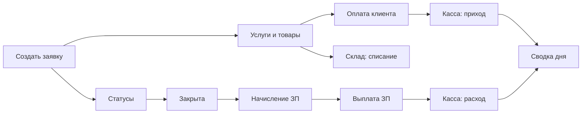

# Пошаговое руководство: полный рабочий день в Profi Service

Сценарий «от входа до сведения кассы»: создание заявки → услуги и товары → оплата → закрытие → начисление и выплата зарплаты → проверка кассы и отчётов.

**Версия:** 1.11  
**Дата:** 2026-08-22  
**Связанный документ:** [USER_GUIDE.md](USER_GUIDE.md) (справочник по всем разделам)

> **Скриншоты.** Реальные снимки лежат в `docs/assets/walkthrough/` и уже вставлены ниже.  
> При смене UI достаточно заменить PNG с теми же именами (см. [assets/walkthrough/README.md](assets/walkthrough/README.md)).

---

## Содержание

0. [Подготовка](#0-подготовка)
1. [Вход в систему](#1-вход-в-систему)
2. [Создание заявки](#2-создание-заявки)
3. [Добавление услуг и товаров](#3-добавление-услуг-и-товаров)
4. [Проводка платежа по заявке](#4-проводка-платежа-по-заявке)
5. [Смена статусов и закрытие заявки](#5-смена-статусов-и-закрытие-заявки)
6. [Печать документов](#6-печать-документов)
7. [Начисление зарплаты](#7-начисление-зарплаты)
8. [Выплата зарплаты](#8-выплата-зарплаты)
9. [Касса: движение денег](#9-касса-движение-денег)
10. [Сводка дня и отчёты](#10-сводка-дня-и-отчёты)
11. [Дополнительно: магазин, закупки, чат](#11-дополнительно-магазин-закупки-чат)
12. [Счета B2B (юрлица и ИП)](#12-счета-b2b-юрлица-и-ип)
13. [Клиентский портал: вход и работа](#13-клиентский-портал-вход-и-работа)
14. [Чек-лист конца дня](#14-чек-лист-конца-дня)

---

## Что нового в версии 1.13 (Windows SETUP 1.0.8, 2026-09-11)

- Windows SETUP **1.0.8**: настройка Python и базы на последней странице мастера (5–10 минут, окно не закрывать); в CRM — «О программе и обновления»; новый EXE ставится поверх без потери базы. [Блог 1.0.8](/blog/windows-setup-1-0-8), [USER_GUIDE § 2.3](USER_GUIDE.md).

## Что нового в версии 1.12 (Windows SETUP 1.0.7, 2026-09-10)

- Склад: **категории** создаются, переименовываются и удаляются прямо на панели товаров; заработало **удаление номенклатуры** и закупки; длинные названия больше не растягивают таблицу, а кнопки действий закреплены у правого края. [Категории склада](/blog/warehouse-categories), [USER_GUIDE § 7.2](USER_GUIDE.md).
- Касса: на карточке способа оплаты видно число внешних приходов и сумму для сверки с банком; **возврат чека** доступен только администратору.
- Windows SETUP **1.0.7**: то же самое в офлайн-установщике, плюс закрытый доступ к папке с базой и настройками. [Блог 1.0.7](/blog/windows-setup-1-0-7), [USER_GUIDE § 2.3](USER_GUIDE.md).

## Что нового в версии 1.11 (2026-08-22)

- Обновили безопасность и ускорили основные разделы; в диагностике — готовые шаблоны текста (поиск в окне заявки). Во вкладке **История** заявки — какие письма ушли клиенту. [Шаблоны диагностики](/blog/order-diagnostics-templates), [письма](/blog/order-customer-emails), [гайд](USER_GUIDE.md).

## Что нового в версии 1.10 (2026-08-20)

- Диагностика: готовые **шаблоны текста** по типу/марке/модели (Настройки → Шаблоны диагностики); другой шаблон заменяет предыдущий. [Блог](/blog/order-diagnostics-templates), [USER_GUIDE § 5.4.2](USER_GUIDE.md#542-диагностика-заявки).
- Заявка, клиенты, склад и настройки открываются быстрее; в журнале заявки сначала последние записи.

## Что нового в версии 1.9 (2026-08-19)

- Магазин: **мастер обязателен**, без него продажа не проводится. [Блог](/blog/shop-master-required), [USER_GUIDE § 8](USER_GUIDE.md#8-магазин).

## Что нового в версии 1.8 (2026-08-16)

- Приёмка: сверху **частые** тип / марка / модель / неисправность; внешний вид по умолчанию «Бывший в употреблении»; после сохранения печатается **квитанция**. Пустая предварительная стоимость в чек не попадает.
- Разовый товар/услуга: поле **Себ. (₽)** — расход в кассе «Себестоимость (разовая)».
- Магазин: частые позиции, чек сразу после проведения.
- Кабинет: история ремонта, профиль, баннер «можно забирать».
- Гайд: [USER_GUIDE 3.6](USER_GUIDE.md). Блог: [серия 1](/blog/core-orders-warehouse-cash), [29](/blog/one-time-cogs-portal-catalog), [30](/blog/shop-popular-checkout), [31](/blog/receipt-print-guides).

## Что нового в версии 1.7 (2026-08-15)

- Перед статусами **Готов / Закрыт** (и любым с запретом правки или финальным) нужен сохранённый **текст диагностики**. Если текста нет, из реестра и карточки открывается окно диагностики; статус меняется после «Сохранить текст». Фото — по желанию.
- Кнопка **Чат** — в левом меню под профилем (на телефоне — в выезжающем меню).
- Смена статуса на другом компьютере того же сотрудника — всплывающее сообщение «Статус заявки #N изменён на: …».
- Блог: [диагностика и чат](/blog/diagnostics-chat-toasts), [вход и файлы](/blog/security-session-files).

## Что нового в версии 1.6 (Windows SETUP 1.0.6, 2026-08-09)

- После сохранения SMTP на Windows перезапустите службу ярлыком **«Profi Service — Перезапуск службы»**, иначе тест письма может идти со старыми `MAIL_*`.
- Плейсхолдеры «От кого»: `Название вашей компании <ваш@email.ru>`. См. [блог 1.0.6](/blog/windows-setup-1-0-6).

## Что нового в версии 1.5 (Windows SETUP 1.0.5, 2026-08-08)

- Почта SMTP: «От кого» должно совпадать с логином; демо `noreply@example.com` больше не ломает Mail.ru; гайд в § 13.5 USER_GUIDE и блок подсказок в Настройках.
- Windows SETUP 1.0.5: дата сборки 2026-08-08, LAN, firewall Any, см. [блог 1.0.6](/blog/windows-setup-1-0-6).

## Что нового в версии 1.4

- При создании заявки можно указать **предварительную стоимость** рядом с предоплатой — оценка для клиента, попадает в квитанцию, в кассу не проводится.
- В квитанции клиента «Внешний вид» и «Комплектация» объединены в одну строку (как в форме приёмки).
- Windows SETUP: доступ из локальной сети по умолчанию; в руководстве — как узнать пароль PostgreSQL для pgAdmin.

## Что нового в версии 1.3

- Описано, **как клиент получает пароль**: письмом «Заказ принят» при указанном email или вручную из карточки клиента (§ 13.2).
- В приветственное письмо добавлена **ссылка на портал** (тег `##PORTAL_URL##`, переменная `PORTAL_PUBLIC_URL`).
- Скриншоты кабинета пересняты после реального входа клиента: дашборд, заявки, платежи, устройства, кошелёк.

## Что нового в версии 1.2

- Добавлен сценарий для **закрытой заявки**: смена мастера и/или менеджера без повторного открытия статуса.
- Зафиксировано поведение зарплаты: начисления по закрытой заявке **переносятся на нового сотрудника** (суммы не меняются).
- Добавлена мини-проверка в дашборде зарплаты после смены исполнителей.
- Добавлен отдельный блок по **клиентскому порталу**: адрес входа, выдача доступа, вход клиента и разделы кабинета со скриншотами.

---

## 0. Подготовка

**Кто проходит сценарий:** менеджер / admin с правами на заявки, склад, кассу, зарплату и отчёты.

**Демо-учётки OSS / Windows SETUP** (пароль `111111`): `admin`, `manager`, `master`, `viewer`.  
На публичном демо смотрите логин на лендинге (например `demo_admin`).

**Перед стартом проверьте в Настройках (admin):**

| Что | Где | Зачем |
|-----|-----|--------|
| Есть статусы «В работе», «Готова», «Закрыта» (или ваши аналоги) | Настройки → Статусы заявок | Жизненный цикл заявки |
| У закрывающего статуса включено **«Начисляет зарплату»** | тот же раздел | Иначе ЗП не начислится при закрытии |
| При необходимости **«Вызывает окно оплаты»** | тот же раздел | Напомнит принять оплату при закрытии |
| Режим печати при закрытии | Настройки → Общие → `close_print_mode` | `choice` = выбор чек/акт |
| На складе есть товар с остатком | Склад → Товары | Иначе запчасть не добавится |
| В справочнике есть услуги | Настройки → Услуги | Для блока услуг |

---

## 1. Вход в систему

### Шаги

1. Откройте адрес CRM (локально: `http://127.0.0.1:5000`, демо: `https://service.nika-crm.ru/`).
2. Если открылся лендинг — нажмите **«Войти в демо»** / **«Войти»** (или перейдите на `/login`).
3. Введите **имя пользователя** и **пароль**.
4. Нажмите **«Войти»**.

Вы попадаете на дашборд (или список заявок — в зависимости от роли и настроек).


### Если не получается

- Неверный пароль / раскладка / Caps Lock.
- HTTPS «висит» у провайдера — попробуйте другую сеть или мобильный интернет.
- У `viewer` мало пунктов меню — для полного сценария нужен `admin` или `manager`.

---

## 2. Создание заявки

### Путь в меню

**Заявки** → **Новая заявка** → URL `/add_order`

### Шаги

1. Откройте форму новой заявки.
2. Заполните блок **клиента**:
   - ФИО (обязательно);
   - телефон / email (по правилам формы);
   - можно выбрать существующего клиента из поиска, если поле это поддерживает.
3. Заполните блок **устройства**:
   - тип, бренд, модель (сверху **частые**, модель связана с типом и маркой);
   - серийный номер, пароль устройства — по необходимости;
   - неисправность (тоже с частыми), внешний вид (по умолчанию «Бывший в употреблении»).
4. Укажите **менеджера** и **мастера** (если поля есть).
5. При необходимости:
   - **предварительную стоимость** — оценка «ориентир для клиента», попадёт в квитанцию; пустое поле в чек не печатается;
   - **предоплату** и способ (Наличные / Перевод) — уйдёт в кассу.
6. Комментарий приёма — кратко.
7. Нажмите **«Сохранить заявку»**.

Откроется **карточка заявки** `/order/<id>` и окно печати **квитанции**.


### На что обратить внимание

- Клиент и устройство сохраняются в базе и пригодятся для портала клиента.
- Предварительная стоимость — только оценка (спор «а вы говорили дешевле»); предоплата обычно сразу уходит в кассу — проверьте позже в § 9.

---

## 3. Добавление услуг и товаров

На карточке заявки найдите блок **«Товары и услуги»** (название может быть «Услуги / Запчасти»).

### 3.1. Услуга

1. Нажмите **«Добавить»** (или **«Добавить услугу»**).
2. В модальном окне откройте список **«Услуги»**.
3. Найдите услугу поиском, укажите количество и цену при необходимости.
4. Подтвердите добавление.

Сумма заявки увеличится на стоимость работ.


### 3.2. Товар / запчасть со склада

1. Снова **«Добавить»** → **«Товары»** (или **«Добавить запчасть»**).
2. Найдите позицию по названию / артикулу.
3. Укажите количество.
4. Подтвердите.

**Важно:** количество **списывается со склада**. Если остатка нет — система покажет ошибку. Сначала оприходуйте товар (Склад → Товары / Закупки).


### 3.3. Разовый товар или услуга

Если позиции нет на складе и в прайсе: добавьте разово название, цену клиенту и **Себ. (₽)** (закупка). При оплате/закрытии в кассе будет расход **«Себестоимость (разовая)»**, в прибыли эта сумма не потеряется. Подробнее: [USER_GUIDE § 5.6](USER_GUIDE.md#56-услуги-и-запчасти).

---

## 4. Проводка платежа по заявке

### Путь

Карточка заявки → блок **«Платежи»** (или **«Оплаты»**).

### Шаги

1. Нажмите **«Добавить оплату»**.
2. Укажите:
   - **сумму**;
   - **тип**: Наличные / Перевод (и др. варианты в списке);
   - комментарий (опционально).
3. Нажмите **«Сохранить»**.

Создаётся платёж по заявке и связанная операция в **Кассе**. Прогресс оплаты на карточке обновляется (не больше 100% в индикаторе).


### Возврат (если нужно)

У строки оплаты → **«Возврат»** → сумма ≤ остатку → причина → подтвердить. В кассе появится расход.

---

## 5. Смена статусов и закрытие заявки

### Рекомендуемый жизненный цикл

```
Новая → В работе → Готова → Закрыта
```

(Имена статусов могут отличаться — смотрите **Настройки → Статусы**.)

### Шаги

1. На карточке нажмите цветную кнопку **текущего статуса**.
2. Выберите **«В работе»** — мастер приступил.
3. Позже выберите **«Готова»** — можно звонить клиенту.
4. Когда клиент забрал устройство и рассчитался — выберите **«Закрыта»** (или ваш закрывающий статус).

**Диагностика.** Перед «Готова», «Закрыта» и любым статусом с запретом правки или финальным сохраните **текст** диагностики (фото JPEG/PNG/PDF по желанию, до 10 файлов). В окне можно выбрать шаблон — текст подставится, другой шаблон заменит предыдущий. Если текста нет, откроется окно — статус применится после «Сохранить текст». Правка уже сохранённого текста и удаление фото — у администратора; на закрытой заявке диагностику меняет только администратор. Клиент видит текст и фото в кабинете.


При закрытии система может:

- показать окно доплаты/оплаты (если у статуса флаг **«Вызывает окно оплаты»**);
- **начислить зарплату** мастеру/менеджеру (если флаг **«Начисляет зарплату»**) — toast вроде «Зарплата начислена»;
- открыть выбор печати (см. § 6).


### Важно про зарплату

Начисление при закрытии происходит **один раз** при первом переходе в статус с флагом «начисляет зарплату». Повторное «открыл → закрыл» не должно плодить второе начисление.

### Смена мастера или менеджера после закрытия

Если в закрытой заявке ошиблись с исполнителем:

1. На карточке в шапке нажмите **«Сменить исполнителей»** (иконка рядом с карандашом; карандаш на закрытой заявке неактивен).
2. Выберите нового **менеджера** и/или **мастера** → **Сохранить**.
3. Заявка обновится; уже созданные начисления ЗП **переедут** к новому сотруднику (суммы те же). Открывать статус «в работу» только ради смены ФИО не нужно.

На открытой заявке ту же замену можно сделать через обычное **«Редактировать»**.

#### Мини-сценарий проверки (рекомендуется)

1. Закройте тестовую заявку, где уже есть начисление зарплаты.
2. Нажмите **«Сменить исполнителей»** и укажите другого мастера и/или менеджера.
3. Откройте **Зарплата → Дашборд** и проверьте, что начисление больше не висит на старом сотруднике.
4. Откройте карточку нового сотрудника и убедитесь, что эта же сумма появилась у него.

Подробнее: [USER_GUIDE § 5.4.1](USER_GUIDE.md#541-смена-мастера-и-менеджера-в-тч-закрытая-заявка), блог [багфиксы кэша и зарплаты](/blog/bugfixes-cache-salary).

---

## 6. Печать документов

После закрытия (или вручную с карточки) доступны:

| Документ | Когда печатать |
|----------|----------------|
| **Квитанция** клиенту | Приём / выдача |
| **Товарный чек** | Продажа запчастей / итоговый чек |
| **Акт выполненных работ** | Закрытие ремонта |
| **Оба документа** | Если выбран режим `both` / кнопка «Оба» |

В модале **«Печать документов»** выберите нужный вариант. Шаблоны правятся в **Настройки → Формы для печати**.

После **создания заявки** квитанция открывается сама (можно сразу отдать клиенту). Если предварительную стоимость не указывали, её строки в квитанции нет.


---

## 7. Начисление зарплаты

### Автоматически

Уже произошло на шаге закрытия (§ 5), если статус настроен правильно.

### Где посмотреть

1. Верхнее меню **Зарплата** → **Дашборд зарплаты** → `/salary`.
2. Найдите сотрудника (мастера) за нужный период — колонка **«Начислено»**.
3. Откройте карточку: `/salary/employee/<id>/<role>`.
4. Вкладка **«Начисления»** — строки по заявкам/датам.

На самой заявке также может отображаться блок начислений ЗП.


### Если начисления нет

- У статуса закрытия нет флага **«Начисляет зарплату»**.
- Нет привязанного мастера/менеджера в заявке.
- Нет права `salary.view`.
- Заявка ещё не в нужном статусе.

---

## 8. Выплата зарплаты

Начисление ≠ выплата. Деньги сотруднику фиксируются отдельно.

### Шаги

1. **Зарплата** → дашборд → откройте сотрудника.
2. Вкладка **«Выплаты»**.
3. Нажмите **«Зарегистрировать выплату»**  
   *или* у строки начисления кнопку **«Выплата»** (выплата в день закрытия заявки).
4. Укажите сумму, дату, комментарий.
5. Подтвердите **«Зарегистрировать выплату»**.

Долг по зарплате уменьшится. Проверка: **Отчёты → Долги по зарплате** (`/reports/salary-debts`).


### Связь с кассой

Выплата ЗП обычно должна сопровождаться расходом в кассе (вручную **Касса → Расход** или автоматикой — по вашей версии/настройкам). Сверьте сумму с § 9.

---

## 9. Касса: движение денег

### Путь

**Касса** → **Движение денег** → `/finance/cash`

### Что вы должны увидеть после сценария

| Операция | Откуда появилась |
|----------|------------------|
| Приход (оплата заявки) | § 4 «Добавить оплату» |
| Приход (предоплата) | § 2, если указывали |
| Расход (выплата ЗП) | § 8 + ручной расход, если нужно |
| Расход (возврат) | если делали возврат |

### Ручные операции

1. **Приход** / **Расход** / **Перевод** — кнопки на странице кассы.
2. Укажите сумму, статью (категорию), комментарий, кассу/счёт.
3. Сохраните.

Итоги страницы: **баланс / приход / расход** за выбранный период.


---

## 10. Сводка дня и отчёты

### 10.1. Сводка дня (оперативка директора)

**Отчёты** → **Сводка дня** → `/reports/day`

1. Нажмите **«Сегодня»** или выберите дату → **«Показать»**.
2. Просмотрите блоки: касса за день, заявки, зарплата и др.


### 10.2. Отчёт по кассе

**Отчёты** → **Касса** → `/reports/cash` — свод оплат и методика расчёта за период.

### 10.3. Отчёт по зарплате

**Отчёты** → **Зарплата** / **Зарплата → Отчёт по зарплате** → `/reports/salary`.

### 10.4. Журнал действий (аудит)

**Отчёты** → **Журнал действий** (в сайдбаре отчётов — «Логи действий») → `/reports/action-logs` — кто что менял.


---

## 11. Дополнительно: магазин, закупки, чат

Эти шаги не обязательны для «одной заявки», но часто входят в день СЦ.

### 11.1. Быстрая продажа в магазине

1. **Магазин** → **Продажи** → `/shop`.
2. **Добавить продажу** — сверху **частые** услуги и товары, слева каталог, справа чек.
3. Клиент необязателен, **мастер обязателен**. Способ оплаты и **Провести** — сразу товарный чек. Без мастера продажа не сохранится.
4. Проверьте списание на складе и приход в кассе.

Подробнее: [USER_GUIDE § 8](USER_GUIDE.md#8-магазин).


### 11.2. Закупка на склад

1. **Склад** → **Закупки** → `/warehouse/purchases`.
2. Создайте закупку, позиции, поставщика.
3. Завершите закупку → остатки вырастут.
4. При необходимости расход в кассе за оплату поставщику.


### 11.3. Чат сотрудников

1. В **левом сайдбаре** нажмите **«Чат»**.
2. Укажите подпись «кто вы на этом ПК», если спросили.
3. Напишите коллегам; красный бейдж — непрочитанные.


### 11.4. Закрепление важной заявки

В **Заявки → Список заявок** (по умолчанию фильтр **«Все в работе»**) нажмите **«Закрепить»** — заявка поднимется вверх у всех сотрудников.

---

## 12. Счета B2B (юрлица и ИП)

Для организаций и ИП: выставить счёт, напечатать бланки и отметить оплату.

### 12.1. Реестр счетов

1. В **левом сайдбаре** откройте **Счета** → `/invoices`.
2. Фильтруйте по статусу (черновик / не оплачен / оплачен).
3. Откройте карточку счёта или создайте новый.


### 12.2. Настройки продавца и шаблоны

1. **Счета → Настройки** → `/invoices/settings`.
2. Заполните банк, БИК, счета; загрузите логотип, подпись, печать.
3. При необходимости задайте **макс. размеры** логотипа/подписи/печати (px).
4. Ниже отредактируйте HTML-шаблоны счёта, акта и накладной (TinyMCE → **Предпросмотр** → **Сохранить**).


### 12.3. Карточка и печать

1. Откройте счёт (например из реестра).
2. Проверьте покупателя и позиции.
3. Печать: **Счёт** / **Акт** / **Накладная** (накладная — только товары).
4. Рядом кнопка **жив.** — тот же документ **без** картинок подписи и печати (для проставления живых). На предпросмотре можно переключить режим в панели сверху.
5. Документ открывается на формате A4 с полями из общих настроек печати.


### 12.4. Новый счёт и оплата

1. **Счета → Новый счёт** → `/invoices/new` (или «Выставить счёт» из заявки).
2. Выберите клиента ИП/юрлицо; товары — **из каталога**.
3. **Отметить оплаченным**:
   - со связанной заявкой → платёж по заявке;
   - без заявки → продажа в магазине (касса + склад), алерт на карточке.


Подробнее: [USER_GUIDE §10](USER_GUIDE.md#10-счета-юрлица-и-ип), блог [печать и шаблоны](/blog/invoices-print-ux), [живая печать](/blog/invoices-blank-signs).

---

## 13. Клиентский портал: вход и работа

### 13.1. Где вход для клиента

- Локально: `http://127.0.0.1:5000/portal/login`
- Публичное демо: `https://service.nika-crm.ru/portal/login`

Важно: это отдельный вход от CRM сотрудников (`/login`).


### 13.2. Как клиент получает пароль

Пароль портала создаётся **автоматически при первом создании клиента** в CRM — отдельно «включать портал» не нужно. Различается только способ передачи пароля клиенту.

**Путь А — письмом, если в заявке указан email**

При сохранении новой заявки клиенту уходит письмо **«Заказ принят»**. В нём есть всё для входа:

| В письме | Что подставляется |
|----------|-------------------|
| Ссылка задать пароль | `##PORTAL_SETUP_URL##` — `/portal/set-password`, действует 2 дня |
| Адрес входа | ссылка на `/portal/login` вашего сервера |
| Логин | телефон клиента |

Клиент открывает ссылку из письма, задаёт свой пароль, затем входит по телефону — диктовать пароль по телефону не нужно. Открытый пароль в шаблоне (`##PORTAL_TEMP_PASSWORD##`) больше не используется.

Что нужно, чтобы письмо ушло:

- в **Настройки → Автоматизации** включён пункт «Заказ принят»;
- настроен SMTP (**Настройки → Почта**);
- в переменной окружения `PORTAL_PUBLIC_URL` указан публичный адрес CRM (например `https://crm.example.com`) — иначе в письме будет пустая ссылка. Если переменная не задана, адрес берётся из первого домена в `TRUSTED_HOSTS`;
- в шаблоне письма присутствует тег `##PORTAL_SETUP_URL##` (в шаблоне по умолчанию он уже есть; свой шаблон правится в **Настройки → Шаблоны писем → Заказ принят**).

**Путь Б — вручную, если email не указан**

1. Откройте **Клиенты** (`/clients`) и выберите нужного клиента.
2. Нажмите **«Редактировать»** — блок **«Пароль для портала»** внизу формы.
3. При создании клиента пароль показывают **один раз**. Потом открытый пароль не хранится: задайте новый в поле пароля и сохраните (сброс).
4. Передайте клиенту телефон и этот пароль; при первом входе он сменит его сам.


### 13.3. Как входит клиент

1. Открывает `/portal/login`.
2. Вводит телефон и пароль.
3. Если это первый вход, задаёт новый пароль.
4. Попадает в личный кабинет `/portal/dashboard`.


### 13.4. Разделы портала

- **Мои заявки** — `/portal/orders`. Клик по строке открывает карточку: диагностика с фото, услуги, суммы и **печать чека**.
- **История ремонта** — `/portal/history`. Хронология всех ремонтов, диагностика и гарантия.
- **Мои устройства** — `/portal/devices`. Техника, которую обслуживали в СЦ; под каждым устройством — его заявки.
- **Платежи** — `/portal/payments`. История всех оплат.
- **Кошелёк** — `/portal/wallet`. Предоплаты и переплаты.
- **Профиль** — `/portal/profile`. Контакты сервиса и смена пароля.


---

## 14. Чек-лист конца дня

- [ ] Все выданные клиентам заказы в статусе **Закрыта**
- [ ] Оплаты по закрытым заявкам проведены (§ 4)
- [ ] Начисления ЗП видны на дашборде (§ 7)
- [ ] Если меняли мастера/менеджера на закрытой заявке — начисление ЗП у нового сотрудника (§ 5 «Смена мастера…»)
- [ ] Фактические выплаты сотрудникам зарегистрированы (§ 8)
- [ ] **Касса → Движение денег** сходится с наличкой в ящике (§ 9)
- [ ] **Сводка дня** просмотрена (§ 10)
- [ ] Расходники/закупки оприходованы, если были (§ 11.2)
- [ ] Нет «висящих» заявок в «Готова» без звонка клиенту

---

## Скриншоты

### Могу ли я сам сделать скриншоты?

| Способ | Да/нет | Комментарий |
|--------|--------|-------------|
| Сгенерировать «фейковый» UI картинкой | **Нет (не делаем)** | Вводит в заблуждение |
| Снять реальный UI автоматически | **Да, скриптом** | Нужен запущенный CRM + Playwright |
| Снять вручную вами | **Да** | Win+Shift+S / ScrLng → положить файлы в папку |

В этой сессии агента **нет встроенного браузера** для кликов по CRM. Поэтому гайд подготовлен с **плейсхолдерами**; картинки добавляются после съёмки.

### Куда класть файлы

Каталог: `docs/assets/walkthrough/`

Имена файлов — как в ссылках выше, например:

```
01-login.png
02-dashboard.png
…
23-staff-chat.png
24-invoices-list.png
25-invoice-settings.png
26-invoice-detail.png
27-invoice-print-bill.png
28-invoice-create.png
29-portal-login.png
30-portal-clients-list.png
31-portal-client-card.png
32-portal-password-issued.png
33-portal-login-filled.png
34-portal-dashboard.png
35-portal-orders.png
36-portal-payments.png
37-portal-devices.png
38-portal-wallet.png
```

Рекомендуемый размер: ширина ~1200–1600 px, формат PNG или WebP.

Пересъёмка: откройте CRM (локально или [демо](https://service.nika-crm.ru/)), сделайте снимки экранов по шагам выше и замените файлы с теми же именами в `docs/assets/walkthrough/`.

---

## Краткая схема потока денег и ЗП



---

*Документ можно дополнять скриншотами без правки текста — достаточно положить файлы с теми же именами в `docs/assets/walkthrough/`.*
